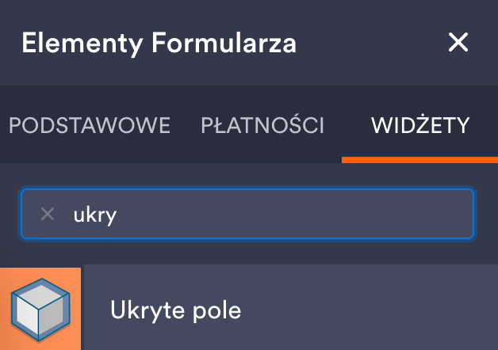
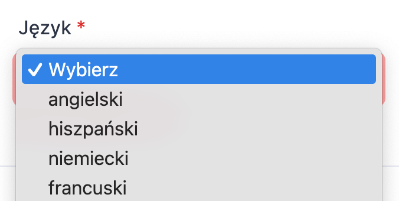
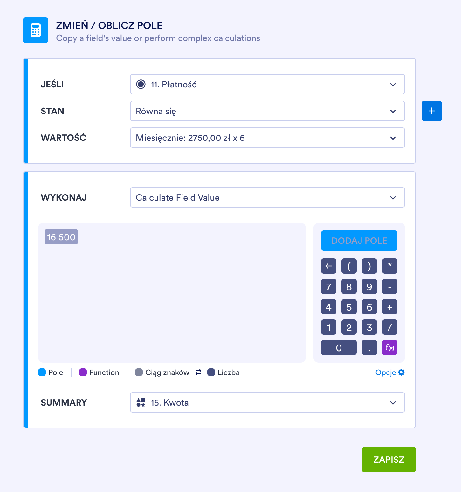
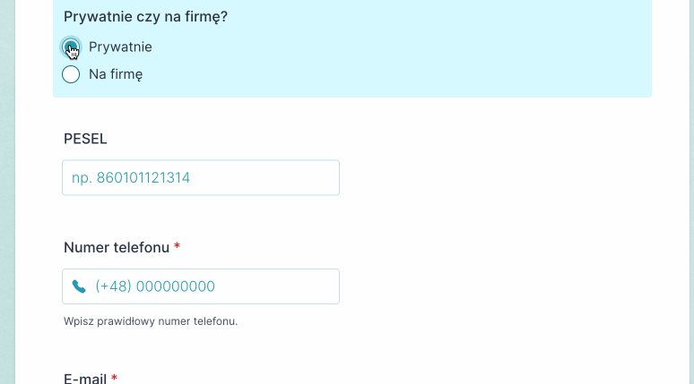

Chciałbym opowiedzieć o tym, jak zautomatyzować zbieranie danych od klientów. Wyobraź sobie, że masz już klienta w CRM-ie lub Excelu, ale do umowy i faktury potrzebujesz dodatkowych informacji, takich jak adres czy NIP. <!-- truncate -->Wysyłasz więc e-mail z prośbą o brakujące dane, a następnie ktoś ręcznie wprowadza je do systemu. 

Brzmi znajomo? Niestety, w takim procesie łatwo o błędy, a literówki i brakujące pola prowadzą do kolejnych telefonów, e-maili z przypomnieniem, opóźnień i niepotrzebnego zamieszania.

## Rozwiązanie? Formularz Jotform

Zdecydowałem się zbierać dane od klientów za pomocą interaktywnego formularza. Do tego celu wybrałem darmowy kreator formularzy [Jotform](https://www.jotform.com/pl/). Zamiast wymieniać dziesiątki wiadomości e-mail, wystarczy wysłać klientowi link do formularza, w którym samodzielnie uzupełni wszystkie niezbędne informacje. Dzięki temu mam pewność, że dane są kompletne i poprawne.

## Korzyści z użycia formularza

* Wszystkie informacje w jednym miejscu  
    Klient widzi jeden formularz, w którym wpisuje wszystkie dane potrzebne do umowy i faktury. [Jotform](https://www.jotform.com/pl/) nie tylko zawiera wiele gotowych elementów, ale też sprawdza czy dane wprowadzane do formularza są poprawne (o tym za chwilę).

    

* Brak potrzeby ręcznego wprowadzania danych  
    Dane mogą być automatycznie przesyłane do systemu, z którego korzystasz, jeśli użyjesz unikalnego identyfikatora klienta.

    🔧 W [Jotform](https://www.jotform.com/pl/), w menu **Widżety**, możesz dodać **Ukryte pole** (`ukrytyid`). Ustawiasz nazwę ukrytego pola, które będzie częścią URL formularza. Kiedy klient prześle formularz, ukryte pole posłuży jako identyfikator. Dane klienta trafią dzięki temu do właściwego miejsca w CRM-ie lub arkuszu kalkulacyjnym.

    
    
    

* Wybór tylko dostępnych opcji  
    Możesz stworzyć z góry zdefiniowaną listę opcji dostępnych dla klienta. Lista wyboru zapobiega błędom i minimalizuje konieczność ręcznego poprawiania danych. Dzięki temu klient w zasadzie nie może podesłać błędnych danych.

    

* Dynamiczna kalkulacja ceny  
    W formularzu zamówienia klient od razu widzi, ile zapłaci, w zależności od wybranych wcześniej opcji. Automatyczna kalkulacja ceny zwiększa przejrzystość oferty i ułatwia podjęcie decyzji o zakupie.

    🔧 W ustawieniach formularza [Jotform](https://www.jotform.com/pl/) wybierz **Warunki**, **Add conditions** oraz **Zmień / Oblicz pole**. Ustawiasz tu całą logikę kalkulacji. Możesz też zdecydować, czy osoba wypełniająca formularz będzie widzieć wartości kalkulacji czy też dane te będą ukryte i dostępne do wykorzystania w kolejnych krokach.

    

* Formularz dostosowany do klienta  
    Jeśli klient wybierze opcję **Prywatnie**, system poprosi go o podanie numeru PESEL. W przypadku zamówienia **Na firmę**, formularz wyświetli pole na NIP, pomijając PESEL, który nie jest w tym przypadku potrzebny.

    

## Co dalej?

Po przesłaniu formularza dane automatycznie trafiają do systemu. Nie ma potrzeby ręcznego ich wprowadzania ani dopytywania klienta o brakujące informacje. Na ich podstawie można od razu wygenerować umowę, fakturę czy potwierdzenie zamówienia. W efekcie: mniej błędów, niższe koszty i szybsza obsługa klienta.

## Dlaczego warto?

Kreator formularzy to proste, ale skuteczne narzędzie, które pozwala zaoszczędzić mnóstwo czasu i zautomatyzować proces zbierania danych. To także sposób na lepszą obsługę klienta i ograniczenie liczby powtarzalnych, czasochłonnych zadań.

🚀 Widzisz w swojej firmie miejsce na podobne ułatwienia? 
